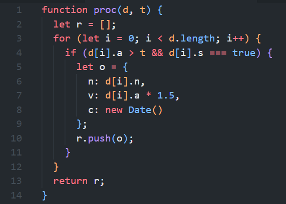
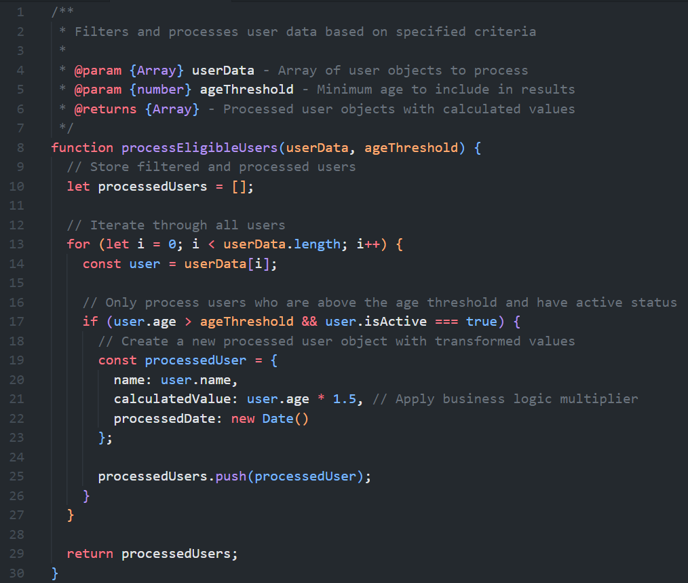
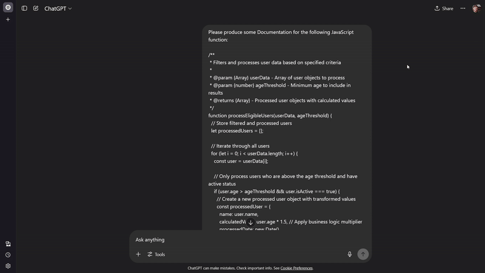

Whether it's best practices for producing; maintaining; or hosting Documentation, this article contains my thoughts originally voiced through a talk of the same name given at the Cardiff Software Meetup "Unified Diff" on the 5th of June 2025.

<!-- Full Blog Post to Follow, will not be shown on main "/blog" page -->
<!-- truncate -->

## Docs Scale with Teams

How many meetings have you been in where you've either been asked to explain a feature you've made previously, or are asking a colleague to explain how to use one of their features?


From  my experience, all developers appreciate well documented code, but very few seem keen to actually write the documentation themselves. I myself have experienced being called one of few developers that "value writing documentation" within teams I have worked in previously.

The hesitancy to produce docs is likely due to the time it takes to produce them, combined with the worry that the time spent writing the Docs would have been wasted due to the docs not actually being valued or used in the day-to-day life of fellow developers. This is often not the case, and in fact the reverse, in that as a company scales documentation becomes more and more effective and useful throughout the organization as a whole.

For smaller passion projects with only one or two developers, Docs may not be necessary as developers have the head-space to manage their own knowledge base. However, as companies scale and more features are added more rapidly, Documentation becomes increasingly important to manage what information is present and where/how it can be accessed throughout an application.

Other factors can affect this, for example, Company Culture:

- How much reliance is there on tribal knowledge vs written knowledge?
- How much do people discuss with others in office vs wanting to read docs?
- Remote working will impact this
  - Less easy to just ask someone so docs may be more useful

## Producing Docs

Firstly, let's discuss the different methods which exist for helping produce Docs efficiently and effectively.

### What are Docs

Most people think of something like a README when Docs comes to mind, but it is often so much more than that.


Architecture Diagrams, Onboarding Guides, API Specs... These can all be vitally important tools for helping developers understand how to implement/work with/build on top of the features you create.

### Code as Docs

A great place to start is your codebase itself. Let's take a look at s poorly documented code block below:



While this code is functional, it is unclear what this function does, how to use it, or what each variable is. However, spending some time to properly name variables and write out some basic and XML style comments can massively increase the readability and maintainability of this code.



It suddenly becomes much easier to tell what the function does, what each variable's purpose is, and how it can be used effectively in a wider codebase. While this example and difference between these two functions is obviously an exaggeration for the majority of cases, it helps to show how big an impact this can help. It's also not massively dis-similar to some code I have seen, especially in lower-level and traditionally type-unsafe languages such as Python.

### Enter the Tech Writer

Another option is bringing on additional team members who specialize in writing technical documentation. I personally was not aware this was an option until it was mentioned in a Linux Foundation course which helped inspire the talk this article is based on.

Traditionally used in larger organizations and team structures, these people are professionals at turning comments or function outlines into professionally formatted pieces of documentation. This helps developers spend less type worrying about docs, as the style, clarity, and formatting is handled for them while they produce a base form of the content itself which the full docs are based on.

However, they will often require a light form of docs to write their full docs. So if the developer is already spending time writing the light version, why not just write the full version themselves? It's for this reason that they are often used in companies where writing docs is much more of an afterthought, or they are brought in to help teams "catch up" on their docs.

### Docusaurus and Friends

There are some existing tools which can be used to generate static sites used for hosting your Documentation. The main one I have seen, and recently had some experience with, is Docusaurus. Free, Open Source, and powered by React, it's highly customizable and very easy to use.

Straight out of the box, by running the command below, you are provided with a full framework, and an easily customizable and usable site ready to be added to with your own data.

``` bash
npx create-docusaurus@latest my-website classic
```

And with all pages, including the main page if you don't potentially losing out on some functionality options, being possible to be written in Markdown, it's easily accessible to all levels.

This very website is built using a Docusaurus base, showing just how versatile it is in it's functionality and usage possibilities. By renaming their "docs" section to "portfolio", I am able to host outlines of my projects, and their "blog" feature allows me to post articles like this with ease using pure Markdown.

Like anything, it does have it's limitations. From my findings it's difficult/not possible to lock pages behind an authentication layer, which makes it a non-ideal option for private or internal documentation. I'm also unsure about the ability to gather page data from an external source on demand, for example from an S3 bucket, so the number of files and general repository size may become difficult to manage at scale.

### Docs that Write Themselves

Whether it's Swagger for API frameworks like SpringBoot and .NET, or Storybook for UI Components, there are several tools which exist to build "Living Documentation" out of the comments and code you pipe into your applications.

While often not explicit exportable for hosting elsewhere, these types of docs can be immensely helpful for both testing local versions of your applications, as well as informing what sort of content should go into more formal and published documentation.

### AI: Help or Hype

I tried to avoid it as much as possible, but it's 2025 and AI feels like it has to be mentioned briefly here.

Let's look back at that well-commented section of code from earlier. Using ChatGPT, passing in a very simple and un-detailed prompt of "Please produce some Documentation for the following JavaScript function", it outputted the following:



This can be extremely useful for generating a boilerplate base piece of documentation which can then be added to and validated before being deployed. For public-facing projects, or private projects using the new GitHub x ChatGPT links provided by the paid "Codex" feature, you can also simply provide it a link to a file (or repository) in GitHub to produce docs for larger sections of code without needing to copy over each function or file individually.

However, like all AI projects currently, it can have it's downsides:

- AI has been known still to hallucinate at times, so always verify what it is telling you
- It is only as good as the code you pipe into it, so if your code is poorly commented it will struggle to produce valid docs of a high quality.

## Hosting Docs

So, now that we have our docs, where do they live, and how are they accessed? Like most things in the world of Software, the simple answer is "it depends".

### Publicly Accessible Docs

Public docs are easy. Any public hosting platform will work, depending how you've generated them. Docusaurus for example can be very easily hosted on GitHub pages and has guides inbuilt to their own Docs for how to do this.

Personally, I'm using Firebase from Google for this Portfolio site, but that's mostly because I'm familiar with it more from previous project usage, and might use some of it's other features for future sections and additions. For other projects, it will likely be overkill and something simpler like Netlify; Vercel; or any other hosting platform would likely suffice.

### Private and Internal Docs

Internal or Private documentation becomes that little more complicated due to the necessity of it being locked behind some authentication layer. For ease of access and setup, services like Confluence and Sharepoint can be used, however these are limited often to purely "Document based Docs", stuff like Word or OneNote, so depends how your documentation is being generated.

However, for teams which are already relatively invested in Cloud Infrastructure, it may become practical to host these documentation files in something like an S3 bucket. Access restrictions can be more customizable through IAM roles provided to those with access requirements. For example, access could be restricted based on Project or Team depending on what is necessary to be accessed for those specific areas.

### Keeping Docs Alive

It's the simple fact that for documentation to remain useful, it must be regularly updated and maintained.

We can steal processes from traditional Software Engineering to help with this. Systems like Versioning, Review Cycles, and integrating documentation creation periods into workflows can help massively with ensuring docs stay up to date and well maintained.

It is also often the case that, when Docs are embedded in with code, deployment and maintaining processes can be integrated into existing CI/CD pipelines.

## Final Thoughts

If you're wondering if you should be writing docs, the answer is a resounding "YES!". Even if you think your project or function is a simple one, a simple piece of documentation could save someone a lot of pain later down the line.

Like anything, the only way to improve is to practice and get feedback. A good place to start is often to write docs that you think would be useful to a future version of yourself. After all, it's not unlikely that one of the most probable future users is yourself.

Bad docs are often better than no docs at all, so even if writing isn't your forte still get something created. And like anything in the world of Software, the best way to get better is practice!

Another piece of advice I've often seen is to think from a "code-outwards" perspective. As someone much wiser than me once said:

> The best Code is self-documenting, but the best Teams document anyway.

I look forward to reading more and better docs in the future!
