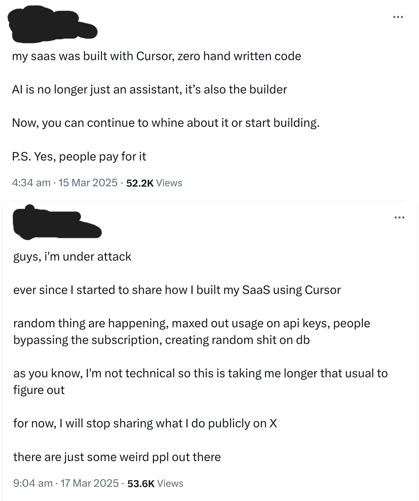

<!-- Post Overview/Introduction section, to be shown on main "/blog" page -->

While scrolling my news feed, an article popped up which caught my interest, albeit for the wrong reasons. Here so follows my response to the ["Writing code is so over"](https://www.infoworld.com/article/4096265/writing-code-is-so-over.html) article from Nick Hodges on InfoWorld.

<!-- Full Blog Post to Follow, will not be shown on main "/blog" page -->
<!-- truncate -->

## When "Writing code is so over" Hits Your Feed

When initially reading the article, I couldn't help but feel a little disheartened, having only graduated in the summer of 2023, before the AI bubble that we're seeing today truly began to grow. Reading an article such as this only a couple years after starting my career left me feeling anxious and I couldn't help but worry that I made the wrong decision in my career.

In this modern era of AI, hearing about people vibe-coding prototypes is nothing new. However, there are so many horror stories out there of "vibe-coding gone wrong", including the now rather famous one below, that I was sure that my own career dreams were safe (at least for the time being).

But after hearing now, only 8 months later, that someone has vibe-coded a fully functioning and secure web application with features like Authentication; Logging; and API Key Management, to say I became concerned for my own future as a developer would be an understatement.

However while sat there wallowing in my own self-pity, and debating a few life choices, another thought occurred to me.

## We've Been Here Before

This isn't the first time that a large change in how applications are written and maintained has threatened the Software Engineering employment space, and yet here we still thrive.

Whether it was the introduction of Compilers in the late 1950s killing Assembly Code development, Low- and No-Code solutions coming online in the 1990s and 2000s and threatening more traditional code-based methods, or the emergence of Web Frameworks in the 2010s threatening the end of pure HTML/CSS stacks, the developer lifecycle continued to live on and thrive.

Every time something has raised the abstraction level, we've changed what programmers do, not erased the need for them. I believe that it is and will be the same with the current AI bubble we are seeing emerge.

## What the Article Gets Right

A week to vibe-code a fully functioning Astro site with auth, logging, and API key management is undeniably impressive - six months ago that would have been a slog. Framework churn is real, too; the JavaScript landscape has been reshuffling for a decade, so it’s easy to see why some developers feel tempted to offload choices to an AI and stop caring what’s under the hood.

But jumping from “AI is powerful and convenient” to “writing code is over” skips a few key steps. Reliability, security, and maintenance still hinge on human judgement. Integration work, trade-off decisions, and accountability don’t disappear just because an agent can scaffold a demo. The tool got faster; the responsibility didn’t go away.

## Power Tools, not Replacements

Across industries over the years, we have seen how technological advances and leaps have altered the work that professionals accomplish. Carpenters use nail guns and power saws, but they still need to measure; plan; and understand structures. Designers use Figma instead of literal paste-up boards, but the tool didn't remove the need for design judgement. Even with the introduction of AI into these fields, and others, over the past few years, it has not replaced the need for workers or personnel but instead altered their role in their field's own ecosystem.

I don't see it being any different in the Software space. While AI can help with:

- generating boilerplate and glue code
- suggesting patterns and frameworks
- speeding up slow and laborious research tasks
- filling in repetitive CRUD

While this encompasses a broad remit of what the "job" of a Software Engineer used to be, it has evolved so much _beyond_ these simple tasks. Humans can, and should, still:

- decide what could be built - and crucially whether it should
- understand the Domain
- talk to Users; Stakeholders; and Teammates
- interpret messy requirements
- weigh trade-offs - speed vs quality, cost vs complexity, etc
- designing the architecture of data models and APIs
- considering security, privacy, and compliance
- reviewing and debugging; making judgement calls on risky changes
- carry responsibility when things go wrong

This isn't the first time the "Job" has changed for Software Engineers. The introduction of Compilers, for example, didn't make programmers obsolete; they shifted our focus from assembly to architecture. AI feels like a similar kind of shift, not an extinction event.

## What Juniors Actually Need to Hear Right Now

For anyone junior reading this and wondering what to do next or how to get ahead in the ever-shifting world of AI, these are the habits that actually move the needle.

### Learn to use AI as a power tool, not an opponent

Let it handle the boring glue, suggest patterns you might have missed, and get you unstuck faster. But don’t hand over the steering wheel or skip the bit where you actually understand what it’s doing, and _why_ it made those choices.

### Double down on fundamentals

Get comfortable with your core language, structures of HTTP and APIs, how different databases really behave, version control, testing, and even writing a bit of Documentation. Mastering the basics are what let you tell the difference between a good AI suggestion and a risky one.

### Develop “AI sense."

Assume it will hallucinate sometimes. Ask it to clarify on performance and scalability implications. Try a couple of prompts and compare the answers. Verify anything non-trivial before it lands in a PR. Treat it like any other teammate whose work you review.

### Non-Technical skills matter more, not less

Clear communication, being able to clarify fuzzy requirements, and taking responsibility when things go sideways are the pieces that don’t get automated. The less time you spend on rote typing, the more these become your edge.

## Concluding Thoughts

So, do I believe that the AI revolution has brought about new and efficient ways of working in and with Software? Yes, of course it has. Do I think that it has killed the need for traditional developers and engineers all together? No, and I don't think it ever should.

Mid- and Senior-level Developers should be educating on how to use AI, not looking to replace Juniors entirely as the original article, and several prominent CEOs, seem to suggest. The future I’m aiming for isn’t ‘no developers’ - it’s developers with better and more efficient tools, which allow them the time to work on more meaningful problems. And that’s a future I still want in on.
